# ATTPC实验总览

[toc]

## Documents

1. **AT-TPC preparations for RCNP campaign**：[Preparations](documents\Preparations.pdf).实验总体设置的介绍
2. **RCNP 网络账号申请以及使用说明：**[RCNP computer](documents\RCNP computer.pdf)
3. **AT-TPC  campaign Wiki记录：** [AT-TPC campaign - PukiWiki-backup](documents\AT-TPC campaign - PukiWiki.pdf)  （pdf备份）， [AT-TPC campaign - PukiWiki](https://www.rcnp.osaka-u.ac.jp/Divisions/np1-a/pukiwiki/?AT-TPC+campaign)   （访问需要RCNP的账号密码）
4. **Fribdaq使用说明:** [Fribdaq_manual](documents\FRIBDAQ Manual.pdf)
5. **EN_daq使用说明：** [ENdaq_manual](documents/man_ENDAQ.pdf)
6. **束流线 Go4使用说明：** [Go4_manual](documents\How to use Go4 analyzer for EN DAQ.pdf) 
7. **实验线路连接示意图：**[线路示意图](imgs\实验线路连接.png)
8. **ATTPC-campaign Google 文档：** [AT-TPC campaign @ RCNP - Google Drive](https://drive.google.com/drive/folders/1X92l1QzWWVbAjU775b2L0s_Bz3ud4rnJ)
9. **实验流程记录：**[how to do an experiment by ghy](documents\实验记录.pdf)


## 总体设置

### 探测器位置

==探测器相对位置如下图所示：==

| 束流线设置                  |
| --------------------------- |
|  |

==探测器实物图相对位置：== 从左至右为：F3靶室（两块PPAC，一块硅）；F3塑闪（两端各有一个光电倍增管用于读出）；插板阀；Ion chamber；ATTPC.

| 探测器位置实物图                                       |
| ------------------------------------------------------ |
|  |


### 逻辑设置

- 主trigger 的逻辑参见 [Preparations](documents\Preparations.pdf) 中的trigger logic。**Trigger = `IC` (delay 100 us) && `Mesh`(stretch 120us)**
-  系统之间的的连接，以及部分NIM机箱的线路连接见[线路示意图](imgs\实验线路连接.png). （==不涉及具体插件的逻辑结构图：==）


==逻辑插件所在的NIM机箱：==

| 逻辑插件示意图（仅供参考）                           |
| ---------------------------------------------------- |
|  |
|                                                      |

上图从左到右依次为：

| 序号   | 1                                               | 2              | 3                       | 4          | 5                                                        |
| ------ | ----------------------------------------------- | -------------- | ----------------------- | ---------- | -------------------------------------------------------- |
| 作用： | 信号衰减；                                      | 信号一分二插件 | Nimttl,ecl信号转换      | 分除插件   | 单路主放                                                 |
| 备注： | 衰减主放输出的IC，Mesh的信号，输出端接入SIS3300 |                | 输出接入scaler的ECL信号 | 分除IC信号 | IC信号主放。该主放一路输出逻辑信号，一路输出整形后的信号 |


| 序号 | 6                                                            | 7                 |      | 8                  | 9                  | 10                 | 11                                |
| ---- | ------------------------------------------------------------ | ----------------- | ---- | ------------------ | ------------------ | ------------------ | --------------------------------- |
| 作用 | 延迟IC信号                                                   | 4通道and 逻辑插件 |      | 产生Mesh信号的gate | Mesh信号的单路主放 | 一分五TTL转NIM插件 | 4路or插件                         |
| 备注 | 实际并没有延迟功能，而是使用展宽的NIM信号末端的del信号产生一个新的NIM信号 |                   |      |                    |                    |                    | 用于输出trigger，以及输出busy信号 |


## EN束流线探测器

### 束流线各探测器位置

| ==EN beamline setting==                            |
| -------------------------------------------------- |
|  |
|                                                    |

1. F0：初级靶  (Be 1/2.5/3/4.5 mm)
2. F1：Al降能片（具体安装厚度待定）+狭缝
3. F2：PPAC + Si (==320um==)+ PPAC + 塑闪（==100um==）
4. F3 ：PPAC + Si (320um)+ PPAC + 塑闪  (100um)

### 初级靶，Al降能片

**初级靶，Al降能片的厚度，位置等具体信息见wiki 中的F1，F2章节**

-  [AT-TPC campaign - PukiWiki](https://www.rcnp.osaka-u.ac.jp/Divisions/np1-a/pukiwiki/?AT-TPC+campaign)   （访问需要RCNP的账号密码），wiki中的Be靶厚度为束流测试结果。
-  [AT-TPC campaign - PukiWiki-backup](documents\AT-TPC campaign - PukiWiki.pdf)  （打印出的pdf备份）

| 束流线磁铁，步进电机，F2荧光靶  （6.4调束）        |
| -------------------------------------------------- |
|  |

==F0，F1 步进电机控制系统使用说明：==<font color = "red">（待补充）</font>

==EN Magnets控制系统使用说明：==<font color = "red">（待补充）</font>


### 塑闪，PPAC


| F2,F3塑闪（图中标签为之前的塑闪厚度）           | F3_PPAC                                          |
| ----------------------------------------------- | ------------------------------------------------ |
|  |  |
| F3塑闪信号                                      | PPAC信号：阳极（黄），阴极（绿）                 |
|                             |                            |

==F2，F3塑料闪烁体==

- 塑料闪烁体两端各有一个光电倍增管读出：F2PL_L，F2PL_R，F2PL_L，F2PL_R
- 厚度：100um
- 工作电压：1500V.  (使用CAEN SY403远控电压)

==F2，F3 PPAC==

- 气压：工作气体为异丁烷（C4H10）,气压在20torr时的工作电压过高。气压后更改为==10torr==

- 工作电压：在说明中设定电压均为==700V==，6.4号针对11Be次级束的工作电压：

  | F2U  | F2D  | F3U  | F3D  |
  | ---- | ---- | ---- | ---- |
  | 813V | 808V | 797V | 851V |


### EN beamline DAQ

==DAQ详细使用说明：==[EN beamline DAQ - PukiWiki](https://www.rcnp.osaka-u.ac.jp/Divisions/np1-a/pukiwiki/?EN+beamline+DAQ)

说明中包含：

- 操作，设置，转数据说明
- 各个通道的mapping
- 刻度数据的位置

- vme获取系统，主要插件为v1190和madc32

## ATTPC探测器

| ATTPC结构示意图                                |
| ---------------------------------------------- |
|  |

ATTPC的主体结构示意图如上图所示。与示意图不同的是，本次束流从pad端入射，pad中心挖去了直径为30mm的圆孔。阳极的电压为10kV，阳极一侧安装了零度探测器。

AT-TPC的各个系统，在[Preparations](documents\Preparations.pdf)有详细的介绍，但是图片清晰度极低。

### GET线路连接，GET获取界面

ATTPC 的电子学路数共10240路，需要10个COBO，每个COBO板支持1024路。

- COBO：连接两个ZAP板，每个ZAP板包含两个ASAD板。因此一块COBO连接4块ASAD
- ASAD：包含4个AGET芯片，每个芯片支持64路电子学。因此一块ASAD路数为256路

| ZAP板对应线序                                  | GET机箱，左侧10个COBO用于ATTPC，最后一个用于零度Si探测器     |
| ---------------------------------------------- | ------------------------------------------------------------ |
|                          |                                             |
| **ATTPC法兰**                                  | **安装内圈ZAP板：需要从内圈逐个向外安装，尤其注意右侧内圈要调整气路管道的位置。** |
|  |                                            |


GET获取的控制界面为`AT-TPC Envoy`，GUI界面如下图所示：

- 最左侧为手动输入的runlog，可以记录束流，电压等信息
- 最上方为当前载入的配置文件`.yaml`，包含增益，trigger延迟，阈值等信息
- 左侧的`Envoy`列表包含11个COBO和一个Mutant，每一个COBO对应一个Mac mini服务器。COBO的状态`status`，有`described,prepared,ready`，需要一步一步progress到ready，才能开始获取。如果修改配置文件，或者出现无法采数的情况，也需要回退到described的状态，重新开始配置。
- 最下方为实时监测的`Data rate`，实验时需要密切关注是否有数据读入。

| AT-TPC envoy                                         |
| ---------------------------------------------------- |
|  |

==目前没有关于AT-TPC envoy 的操作手册，无法处理以下的问题：==

- 如何打开AT-TPC envoy界面
- 如何打开并正确修改配置文件
- 如何连接Mac mini server


### 漂移电场电压

AT-TPC的电子漂移区域可以分为：

- 阴极(-10kV)到V1，电子漂移区域
- V2到pad，信号放大区域

| HV Power control。右下角可以监控每个通道的漏流大小，以判断tpc是否打火 | 漂移以及放大区域的结构                      |
| ------------------------------------------------------------ | ------------------------------------------- |
|         | 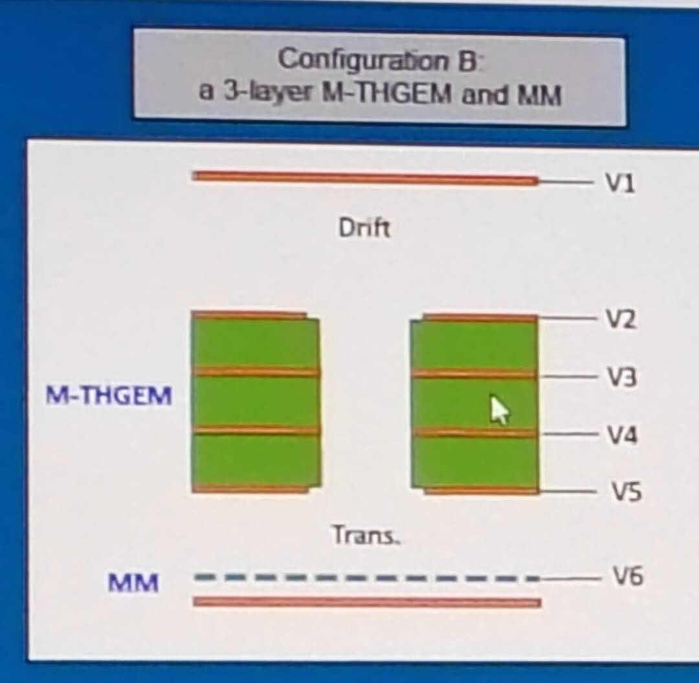                      |
| **V2-V5和塑闪使用同一个高压插件供电。在测试的过程中，V1-V4高压插件损坏，使用另一个高压插件的四路代替。同时V1比较特殊，只能使用原先的插件。** | **某种高压保护插件**                        |
| 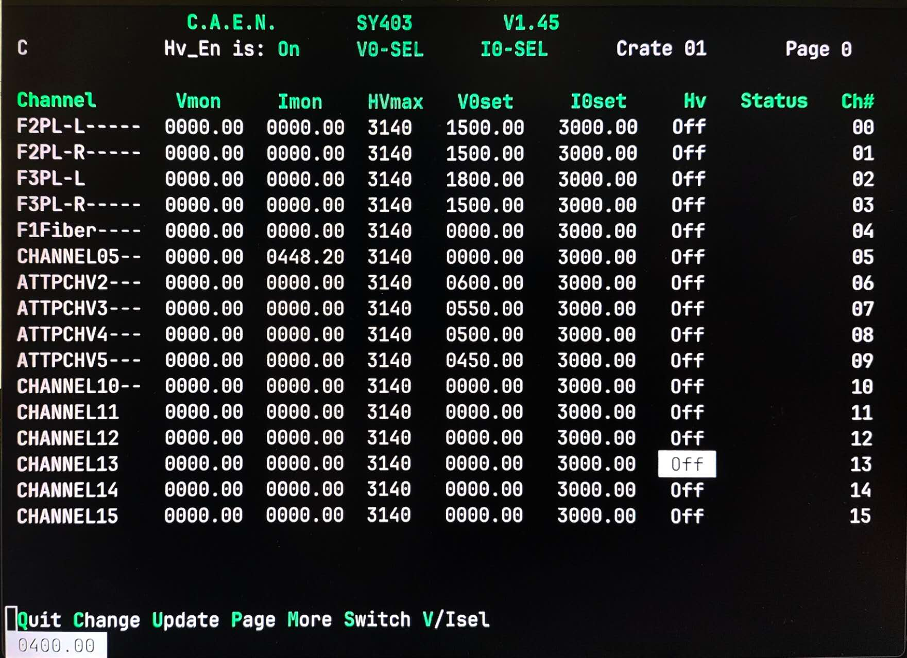                                     |  |


### ATTPC气路

ATTPC的气路目前没有完整的连接逻辑图，也没有实验时的操作手册==待补充==

在气路准备就绪的情况下，只需要在控制界面设定气压值，即可完成，充气，放气，循环的操作。下图中Target和shield正在同时充气，充气是需要维持target的气压略大于shield，以保证target气体的纯净。

| AT-TPC  Gas  Handling  system                        |
| ---------------------------------------------------- |
| 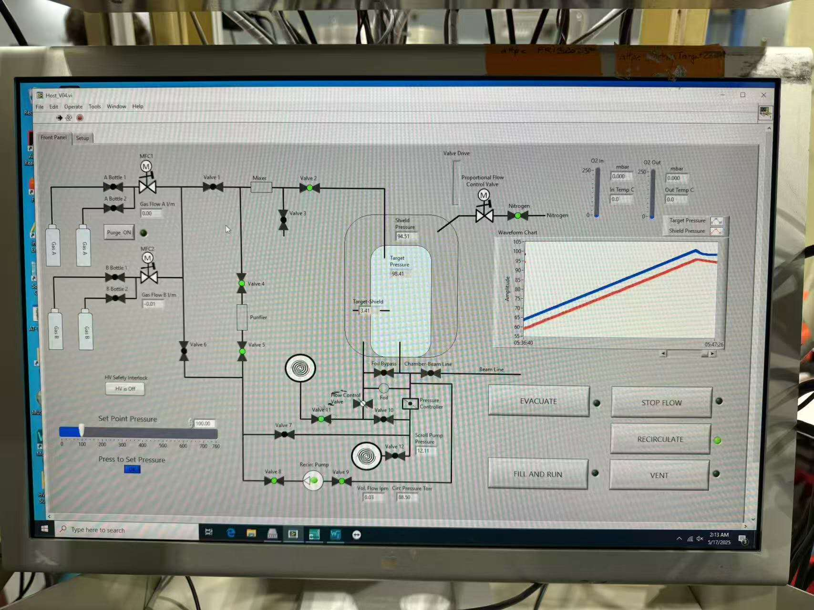 |


### alpha源测试

==首先，使用脉冲发生器，检验pad，GET是否正常工作，以及mapping是否正确==。该步骤在使用get之前都需要检查，因为COBO可能没有正确启动。

在测试时，向Mesh的test端输入一个脉冲信号，该信号为连续的五个脉冲。Mesh上的电压信号会在同尺寸的pad上感应出相同幅度的信号。

下图中为脉冲发生器测试数据，左侧为pad的响应，中间为结合脉冲的时间信息重建的三维径迹，右侧为某一块ASAD上的信号波形。在测试时，主要观察pad的响应。由于两种尺寸的pad信号幅度不同，并且设置了不同的增益，因此在正常情况下，只会表现出两种信号幅度。

当一些通道没有信号时，下图表现为pad信号缺失；当mapping错误时，下图表现为出现多种不同幅度的pad信号。此时需要检查ASAD板是否连接牢固，供电是否正常，重启COBO，线序是否正确~.

在pad的响应图中，可以拖动GUI中的圆圈图标，查看每个pad的mapping，并在最上方界面中查询相应的通道，绘制出原始信号的波形图==（get 采样率12.5 MHz，采样点数512）==。

| 某些ASDA异常的情况    | ASDA均正常的情况                                   |
| --------------------- | -------------------------------------------------- |
| 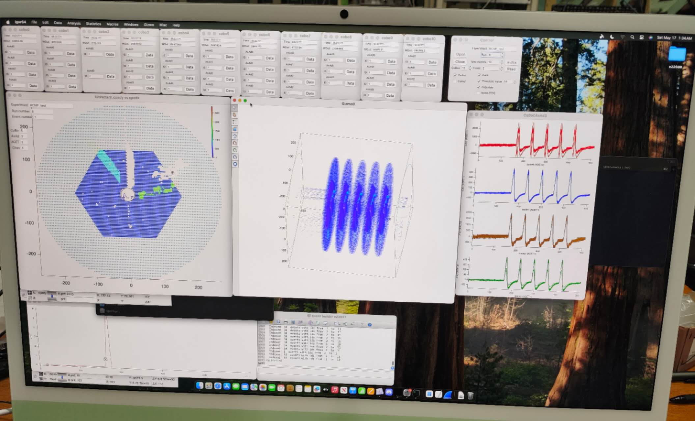 |  |


在脉冲发生器测试之后，即可充入工作气体，加上电压，利用ATTPC内壁上沾染的裂变源(约5MeV)，进行测试。测试时需要对Mesh信号所使用的前放进行降噪，同时根据工作气体和气压仔细调节电压（电压需要根据以往测试的经验进行设置：[部分参考参数](imgs\hv_par.jpg)）。


| 主放输出的Mesh信号                                    | alpha粒子径迹（60torr异丁烷）        |
| ------------------------------------------------- | -------------------- |
| 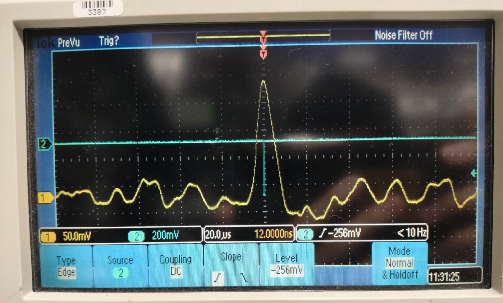 | 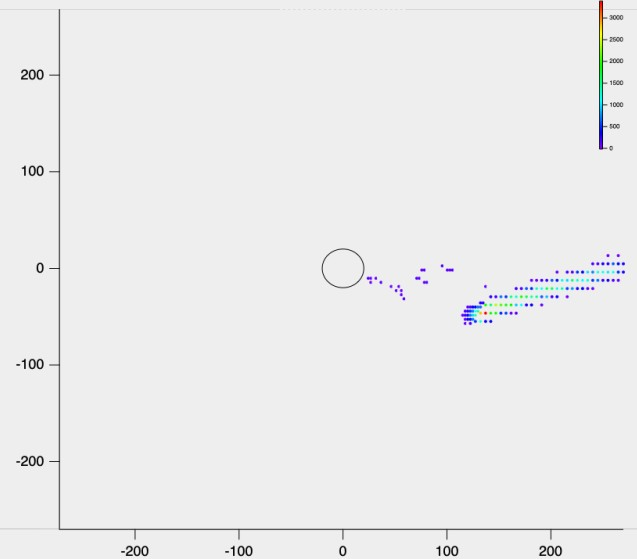 |

alpha粒子的径迹如右图所示，在正常情况下，径迹是一条直线。可以通过能损大小，判断出aplha粒子的出射位置。


增益：120 小pad， 140大pad

## 零度探测器

### Si 探测器

Si探测器使用的型号为ttt4，128$\times$ 128 strips，10$\times$ 10 cm$^2$，500um（第一层） + 1000um（第二层）.

ttt4 每一面设计了四组排针，排针的定义如右图所示。非常诡异的是，ttt4的正反面呈旋转对称结构。无论你将正面还是反面朝上，排针的指向和硅条的朝向都一模一样。说明书的一个细节可以用于区分正反面：观察示意图最下方位置，两个大的金色方块，==上方有一个更小金色的方块，存在这个小方块的即为正面。==（可以放大本页面观察）

| ttt4示意图 | ttt4转接板 |
| ---------- | ---------- |
|     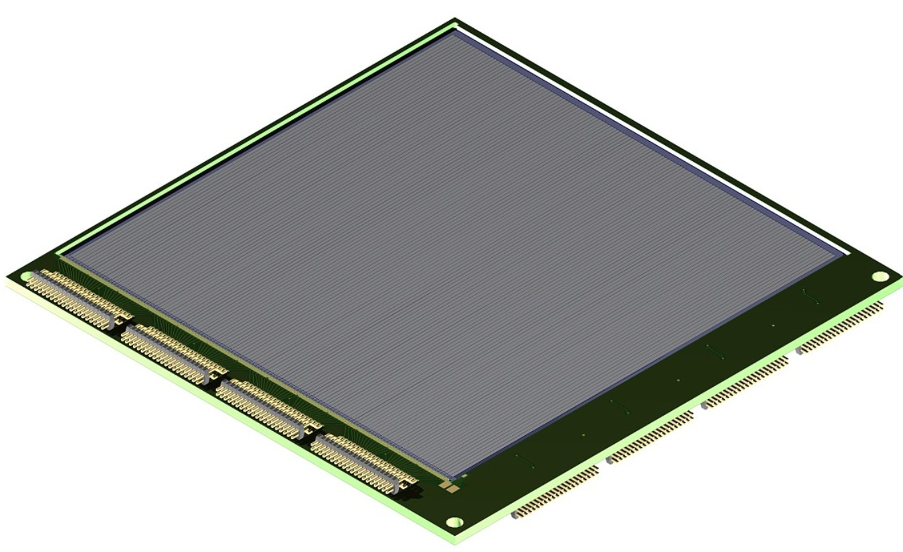     |  |

由于ttt4的对称性，无论是正面面向束流，还是背面面向束流，都不会改变接口的线序。但是ttt4到ASAD的转接板就并非如此了。==其旋转180度也能严丝合缝的使用，但是却会导致Si的某几路信号之间接地。这是测试零度Si时，观察到巨大漏流的原因。==因此，该转接板在使用时需要小心的判断正确的连接方向。

下图为安装了第一层Si的情况，左侧的一块ASAD板用于读出两块Si正面的256路信号，右侧的一块ASAD板用于读出背面的256路信号。在加电压时，需要给一块ASAD的HV1,HV2加上电压（测试时约为100V），另一块ASAD板使用50$\Omega$匹配。

在进行第一层500um硅的alpha源测试时，由于背面转接板方向错误，部分硅条信号接地，导致漏流偏大，能谱分辨较差。测试1000um的硅时，由于始终无法测到信号，纠正了转接板的问题。此时能谱的分辨极好.（==由于数据为h5格式，尚未进行完善的分析==。并且由于第二层硅已经安装上，无法再对第一层硅进行测试。

| 安装在支架上的ttt4   | Si的ASDA板            |
| -------------------- | --------------------- |
| 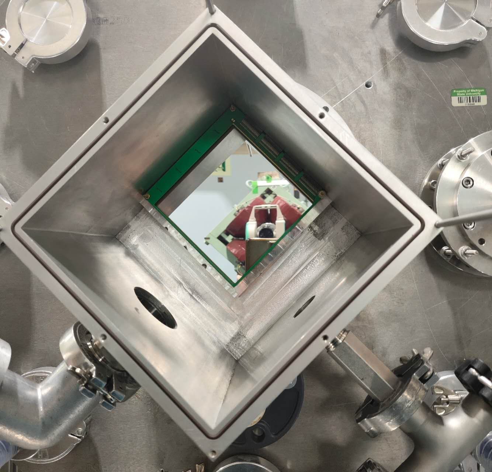 | 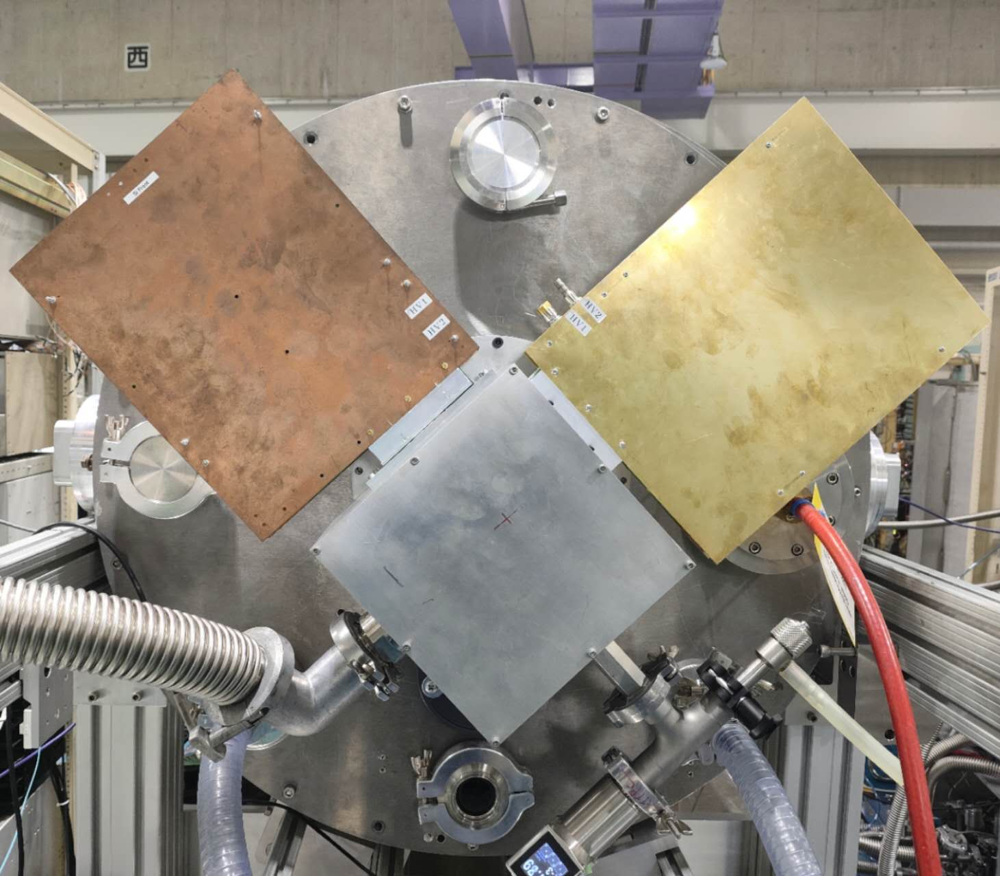 |
| 500um tt4测试数据    | 1000um tt4测试数据    |
| 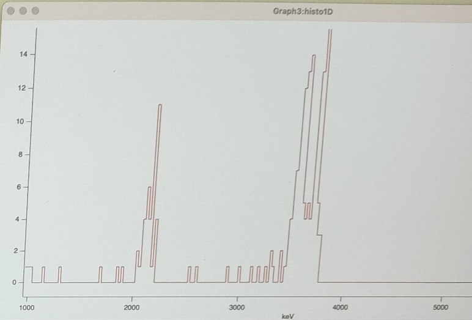 | 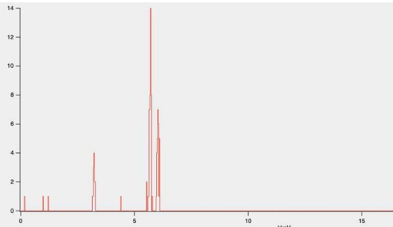 |

### GAGG探测器

Si探测器后方设计了两层GAGG探测器，用于探测零度重离子和gamma射线。所以GAGG均使用APD，型号为`S8664-1010`，灵敏面积为$10\times 10$ mm.

两层GAGG的信号由APD上的2pin线引出，先经过前放，然后经过主放（==MSCF-16==），最后经过==MDU-16==，将主放输出的差分信号转为lemo 单端信号，最后输入firb获取插件。

| 安装完毕的GAGG                                | 尝试包装第二层GAGG   |
| --------------------------------------------- | -------------------- |
|  | 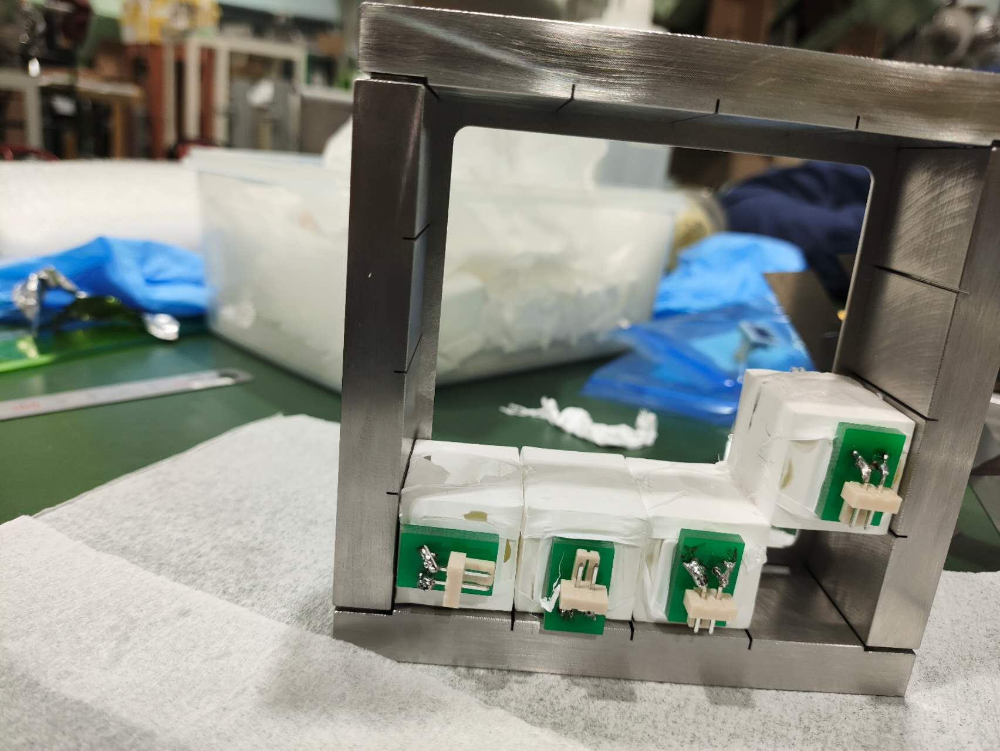 |

最初开始测试GAGG时，测试电压为==400V==，此时观察前放输出的信号，可以频繁的发现由于大火导致的放电信号，表现为：指数衰减信号的上升沿处存在巨大的反冲。因此，在之后的测试中电压控制在==360V==，一组GAGG的漏流约1uA.

>  ==第一层GAGG==

- 尺寸为$18\times 18 \times 20$ mm，光收集面使用光学胶耦合apd，其他面（包括粒子入射面）均使用ESR膜包裹。

- $5\times 5$阵列，但是由于其中一块GAGG实际上是耦合了一块PD，所以实际只使用了24块，在边角的位置去掉了一块。

- 最初测试时使用了25MeV的前放，最后使用了CAEN A1442B前放，该前放为32路，有==40MeV和200MeV==两档量程，可以方便的通过外置跳线进行更改。该前放的最大差分输出为==4.5==V，衰减时间为50us.

- 使用CAEN 前放的200MeV挡位，未加高压时的噪声$\pm 2$~$\pm5$ mV。360V电压，Co60源情况下，前放信号幅度==20-30mV，按照目前的估计该前放满足测量9Li的需求== 

  | GAGG信号上升沿          | GAGG信号幅度           |
  | ----------------------- | ---------------------- |
  | 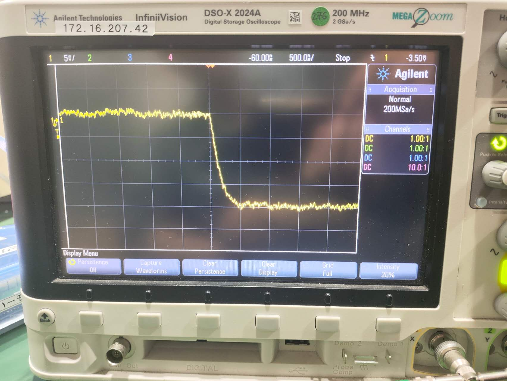 | 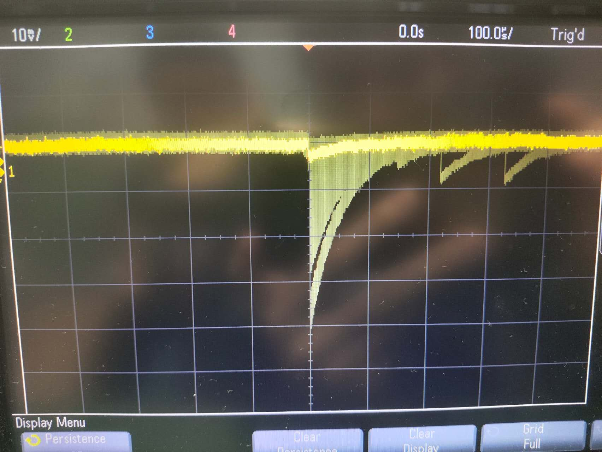 |

  

- 考虑到第一层GAGG在沉积重离子时会产生幅度很高的信号，可能会超过FRIB-daq插件的接受范围。因此主放增益调节为==1==，但是通过示波器观察主放输出信号的幅度，仍然是前放的==2倍==左右。为了降低信号幅度，将第一层GAGG的==MDU-16==的增益调节为==1/2==，此时主放输出的信号幅度和前放接近，主放起到整形滤波的作用。（理论上也可以不使用主放）

>  ==第二层GAGG==

- 尺寸为$20 \times 20 \times 25$ mm，光收集面使用硅脂耦合apd，其他面全部使用生料带包裹。
- 包装第二层GAGG时，由于支架设计的冗余过小，不得不只使用生料带在包装的同时固定住APD，以减少包装材料的厚度。同时还需要去掉支架的格栅，以及部分螺丝。由于只使用了两层生料带，APD固定的并不牢固。
- 使用25MeV量程的前放。360V电压，Co60源情况下，主放信号幅度==100-200mV==. 中途重新插拔了APD的2pin线 之后，前放输出的信号幅度显著降低。（插拔过程中导致硅脂耦合效果变差）==目前没有重新测量分辨率==，观察主放信号，信噪比尚可。


> ==APD 能量和分辨随时间的变化==

使用vme 获取系统，360V电压，Cs137源情况下，对第一层的8块GAGG进行了约22个小时的测试（6.6， 14：00——6.7， 10：00）。下图提取了每半个小时的峰道址和能量分辨率。峰道址呈现出多个极值点，能量分辨则略有变差。峰道址的变化可能和温度有关，==目前没有进行过更长时间的测量==

| 峰道址随时间的变化      | 能量分辨随时间的变化   |
| ----------------------- | ---------------------- |
| 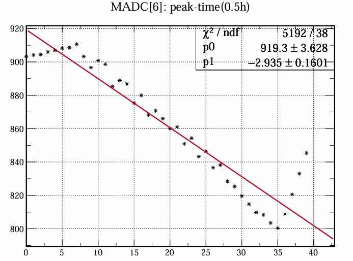 | 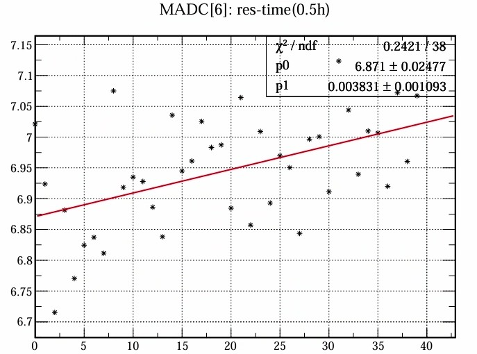 |


### FRIB-DAQ

#### 使用的各个插件

GAGG以及scaler由FRIB的数字化获取系统负责记录。该获取系统有一个建议的使用说明（仅限于start,stop ）：[Fribdaq_manual](documents\FRIBDAQ Manual.pdf). 该使用说明唯一需要注意的一点就是当终端输出和示例不一致，或者无法正常`begin`时，需要使用`./restarting`命令重启系统。

NSCL DAQ的网页详细说明：  [NSCL DAQ Software Documentation](https://docs.frib.msu.edu/daq/newsite/nscldaq-11.3/index.html) 内容过于冗长，参考性较低

| FRIB DAQ获取机箱                                  |
| ------------------------------------------------- |
|  |

- 最左侧的为主控插件VM-USB（说明书：[VM-USB_Manual](documents\WIENER_VM-USB_Manual_R4_2022.pdf) ），如果需要原始数据解码，则需要查阅该说明书~（最好还是不要查阅..........）
- SIS36/38 XX 为scaler 插件，各个通道对应的scaler信号来源：[scaler list](documents\Scaler List-Jin-comment.pdf)
- 中间的插件为v977，具体作用现在不太清楚。
- 中间的三个8通道ADC，为SIS3300/1，两种插件基本一致，说明书见：[SIS330X ](documents\sis3300_v300.pdf) ，最大输入信号5V
- 最后一个插件为16通道ADC，SIS3316，说明书见：[SIS3316](documents\sis3316-m-1-1-v128.pdf)，最大输入信号2/5 V

==目前ADC通道的分配情况：（gagg的mapping还需要进一步确认）==

- SIS3316 的16路，对应第一层GAGG的前16路
- SIS3301(倒数第二个插件)，对应第一层GAGG的后8路
- 第一个SIS3300，前两路为IC，Mesh信号，后六路为第二层GAGG的9-14路（==第二层没有足够的获取通道==）
- 第二个SIS3300，接入第二层GAGG的1-8路  (这几个插件)

#### 关于原始数据解码，.tcl配置文件，以及330X插件，3316插件的简要配置参数

frib_daq生成的数据为.evt结构的16进制文件，目前有用于观察波形的Igor程序。下面简述从中提取外部时间戳，也就是scaler的方法：

> ```
> 第一个事件详细验证：
> 原始数据: 00 1e 00 00 00 04 00 00 00 fb 17 0d 00 00 00 58 57 10 01 77 09 02 00 03 19
> 数据分解:
> 起始标志: 00 1e
> 事件序号位置:  09  (小端序) => 0000000D
> 时间戳位置: 02 0 (小端序) => 01105758
> 间隔4字节: 0 03
> 结束标志: 03 19
> ```

16进制的数据中00 1e实际表示1e 00，标志获取记录到一个event，19 03则表示获取中的第一个插件，19 03之前包含着时间戳和事件序号，之后则为波形数据。

==FRIB_DAQ 配置文件：==

| 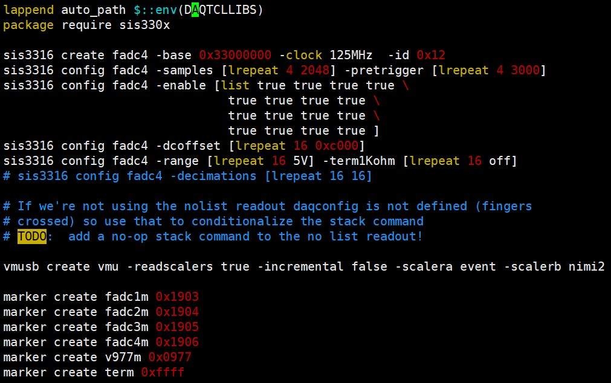   |
| ------------------------------------------------ |
| 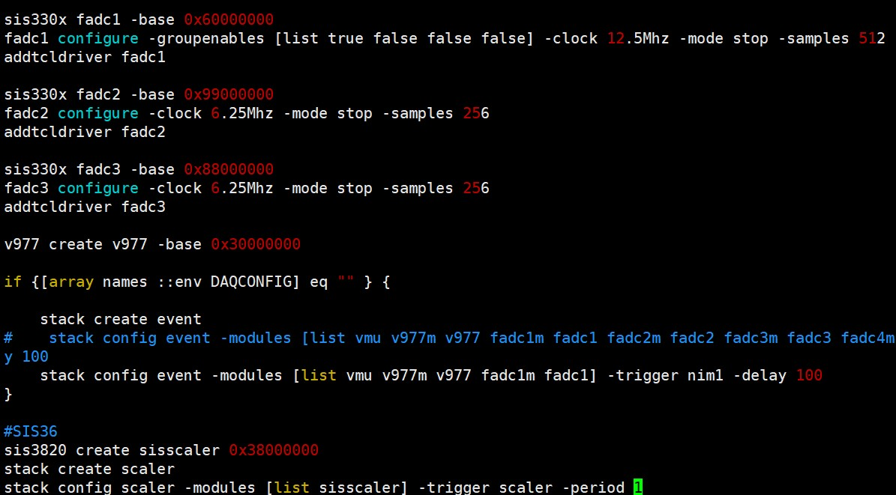 |

- SIS330x 为adc1,adc2,adc3，目前的有两种采样设置，实验时需要根据trigger相对于GAGG信号的延迟重新设置

- SIS3316为adc4，该模块的设置略有不同：

  1. -range 中的参数设置为5V
  2. -dcoffset 中的0xc000 16进制数用于设置基线，该数值越小，基线高度越高，需要根据信号调整。
  3. SIS3316的采样率参数似乎不起作用，始终以125MHz的频率运行
  4. SIS3316 配置中`-samples [lrepeat 4 2048] -pretrigger [lrepeat 4 3000]`，其中2048为采样点数，3000为从trigger到达的位置往回推3000个采样点，然后开始采样。

## E546  

**基本情况**

- ==束流情况==：$^{12}$C$^{4+}$ ，约85MeV，调束时流强约0.8nA，在实验过程中进入attpc的束流强度为5000-10000（ion chamber给出）之间，中途经历过多次调整。在实验中不使用任何束流线探测器

- ==ATTPC设置==： ATTPC工作气体为异丁烷（C4H10），工作气压57.7torr（前大半部分实验）。V_MM = 300V，V_THGEM = 50V。Ion Chamber的工作气体也为异丁烷，气压100torr，工作电压60V.

- Trigger设置：放弃使用`(Mesh && IC)`，使用`(attpc_multi && TC)`作为trigger ，同时只有半径大于==50mm==的pad参与`attpc_multi`的响应。

  ==更换trigger原因：==束流的准直并不能达到所有径迹均限制在空洞的要求，因此仅使用Mesh，会记录大量的束流事件

**可能存在的问题：**

- 实验过程中主要监测了`IC_rate`和`attpc_multi`两个参数，并没有实时监测attpc的气压和电压数据，可能会影响数据分析结果。
- 虽然已经使用了扣除半径50mm以内响应的`attpc_multi` 作为trigger信号，但是在实验过程中经常出现束流强度不变，但是`attpc_multi`大幅上升的情况，此时束流方向发生偏转，需要经常联系加速器进行调整

**初步筛选的 2 track 事件数据：**

| 电荷沉积与射程的二维关联图；两个track的theta角度关联         |
| ------------------------------------------------------------ |
|               |
| 在二维关联图上筛选出12C，同时限制phi角（即限制两个track处于同一个平面），此时的theta角度关联 |
|               |
| 电荷沉积与射程的二维关联图；两个track的phi角度关联           |
|               |
| 在二维关联图上筛选出12C，此时的theta角度关联                 |
|               |


## 网络相关

==从外网（edu）登入rcnp的账户==

- ssh  user@login-a.rcnp.osaka-u.ac.jp
- 输入账户密码，随后ssh跳转到其他服务器

==从内网（rcnp-gp）==登入rcnp账户，rcnp-gp需要绑定设备ip地址

- ssh  user@saho-a
- 输入账户密码，随后ssh跳转到其他服务器

==其他服务器==

- go4 所在服务器，ssh -Y daq@lawrencium (PW: rcnpdaq)

- 调束数据服务器，ssh daq@plutonium -Y （PW: rcnpdaq1）

  1. 原始数据(6.4调束)位置:/home/daq/ridf/attpc
  2. 转出数据位置：/home/daq/exp/attpc/users/trong/ENridf2root

- 可以远程连接frib-daq的中转电脑：ssh  attpc@172.16.204.68  (pw：activetarget)，==E546实验原始数据，decode数据，以及初步的分析程序位于该电脑==

- GAGG主放插件远控服务器：ssh -Y quser@nihonium  (pw: rcnpdaq)

  1. screen /dev/ttyUSB0
  2. SC
  3. 读取参数：RE 0(bus序号) 1(bus中的主放地址)  21(要读取的参数)
  4. 设置参数：SE 0 1 21 10

  
  
  
  
  
  
  
  
  
  
  


